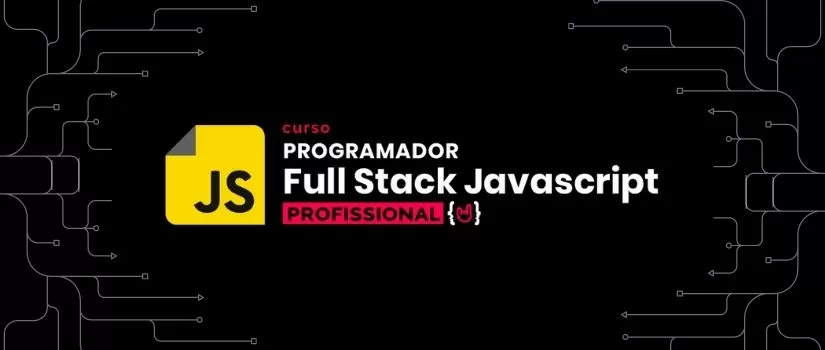

# Programador Full Stack JavaScript - One Bit Code

---

## Sobre

Aprenda com projetos reais que vão além da teoria e te colocam frente a frente com os códigos já nas primeiras aulas!

Vá do básico ao profissional sem perda de tempo e esteja dentro de uma das áreas mais promissoras para o futuro, a programação!

---

## Conteúdo

### **Fundamentos I** ⚙️

<!-- 01. Start no Treinamento -->

  
01. Start no Treinamento

  <table>
    <tr>

- [x] Seja bem-vindo(a)
- [x] Os instrutores
- [x] Livro Programador Full Stack JavaScript (texto)
- [x] Atualizações e melhorias
- [x] Dashboard do treinamento
- [x] Grupo Exclusivo (como acessar)
- [x] Programador e seus super poderes 👨‍🚀
- [x] Profissão do futuro (e do presente)
- [x] Melhorando sua experiência na plataforma [texto 📖]
- [x] Como tirar suas dúvidas [texto 📖]
    </tr>
  </table>

<!-- 02. Entendendo a Web -->

	
02. Entendendo a Web

	<table>
    <tr>

- [x] Seja bem vindo(a) ao módulo Introdução à Web
- [x] O que é a Web e como ela funciona
- [x] Desenvolvedor Frontend, Backend e Fullstack
    </tr>
  </table>

<!-- 03. Conhecendo suas ferramentas -->

	
03. Conhecendo suas ferramentas

	<table>
    <tr>

- [x] Sistema Operacional
- [x] Browser e console
- [x] Configurando VS Code
- [x] Navegação de pastas
- [x] Conhecendo o CodePen
    </tr>
  </table>

<!-- 04. HTML5 -->

	
04. HTML5

	<table>
    <tr>

- [x] Nossos objetivos neste módulo
- [x] Conhecendo o HTML 5
- [x] Estrutura de uma página Web
- [x] Tags básicas do HTML
- [x] Listas no HTML
- [x] Exercício: Criando uma lista
- [x] Resolução: Criando uma lista
- [x] Organizando nosso código com Divs e Span
- [x] Atributos HTML
- [x] Exercício: Guia de galáxias
- [x] Resolução: Guia de Galáxias
- [x] Criando Tabelas
- [x] Exercício: Criando sua primeira Tabela
- [x] Resolução: criando sua primeira tabela
- [x] Conhecendo os Forms
- [x] Criando um form para pesquisar no Google
- [x] Validação de forms
- [x] Aprofundando nos Inputs
- [x] Exercício: Criando seu primeiro Form
- [x] Resolução: Criando seu primeiro Form
- [x] Novidades do HTML5
- [x] Leituras recomendadas
- [x] Elementos semânticos do HTML 5
- [x] Exercício: Criando um site completo
- [x] Resolução: Criando um site completo
- [x] Prova de conclusão com certificado
    </tr>
  </table>

<!-- 05. CSS -->

	
05. CSS

	<table>
    <tr>

- [x] Objetivos deste módulo
- [x] Básico do CSS
- [x] Primeiro CSS
- [x] Cores no CSS
- [x] Background e Borders
- [x] Seletores
- [x] Inspetor do Chrome
- [x] Seletores mais avançados
- [x] Especificidade
- [x] Herança
- [x] Exercício: Recriando um site com CSS #1
- [x] Resolução: Recriando um site com CSS #1
- [x] Texto e Fontes
- [x] Usando o Google Fonts
- [x] Box Model
- [x] Exercício: Recriando um site com CSS #2
- [x] Resolução: Recriando um site com CSS #2
- [x] Prova de conclusão com certificado
    </tr>
  </table>

<!-- 06. JavaScript I - Lógica de Programação -->

	
06. JavaScript I - Lógica de Programação

	<table>
    <tr>

- [x] Apresentação e introdução ao módulo
- [x] Material de Apoio: Mapa Mental
- [x] Dicas e Ferramentas
- [x] O que é uma linguagem de programação
- [x] O que é JavaScript
- [x] Tipos de dados
- [x] Variáveis
- [x] Operadores e expressões
- [x] Comentários
- [x] Quiz 1 - Conceitos básicos
- [x] Usando JavaScript no HTML
- [x] Recursos nativos do navegador
- [x] Exercício 1: Cadastro de usuário - Calculadora de 4 operações
- [x] Resolução do Exercício 1: Cadastro de usuário - Calculadora de 4 operações
- [x] Comparação de dados
- [x] Operadores lógicos
- [x] Quiz 2 - Operações lógicas
- [x] Estruturas condicionais: If e Else
- [x] Exercício 2: Teste de velocidade e Cálculo de dano
- [x] Resolução do Exercício 2: Teste de velocidade e cálculo de dano
- [x] Estruturas Condicionais: Switch
- [x] Exercício 3: Conversor de medidas
- [x] Resolução do Exercício 3: Conversor de Medidas
- [x] Estruturas de Repetição: While
- [x] Exercício 4: Visitando novas cidades
- [x] Resolução do Exercício 4: Visitando novas cidades
- [x] Estruturas de Repetição: Do While
- [x] Exercício 5: Menu interativo e Controle financeiro
- [x] Resolução do Exercício 5: Menu interativo e controle financeiro
- [x] Estruturas de Repetição: For
- [x] Exercício 6: Robô da tabuada e Procurando palíndromos
- [x] Resolução do Exercício 6: Robô da tabuada e Procurando palíndromos
- [x] Estruturas de dados
- [x] Arrays
- [x] Trabalhando com Arrays - Parte 1
- [x] Trabalhando com Arrays - Parte 2
- [x] Exercício 7: Fila de espera e Pilha de cartas
- [x] Resolução do Exercício 7: Fila de espera e Pilha de cartas
- [x] Arrays Bidimensionais
- [x] Objetos
- [x] Quiz 3 - Arrays e Objetos
- [x] Exercício 8: Cadastro de Imóveis
- [x] Resolução do Exercício 8: Cadastro de Imóveis
- [x] Funções
- [x] Parâmetros de uma função
- [x] Retorno de uma função
- [x] Escopo
- [x] Exercício 9: Calculadora geométrica
- [x] Resolução do Exercício 9: Calculadora geométrica
- [x] Métodos
- [x] Funções recursivas
- [x] Funções anônimas
- [x] High-order Functions
- [x] High-order Functions e Arrays - Parte 1
- [x] High-order Functions e Arrays - Parte 2
- [x] Quiz 4 - Revisando Funções
- [x] Objetos Globais
- [x] Exercício 10: Desafio Final
- [x] Resolução do Exercício 10: Desafio Final - Parte 1
- [x] Resolução do Exercício 10: Desafio Final - Parte 2
- [x] Recapitulando o que aprendemos
- [x] Prova de conclusão do módulo
    </tr>
  </table>

<!-- 07. JavaScript II - DOM -->

	
07. JavaScript II - DOM

	<table>
    <tr>

- [x] Introdução
- [x] Eventos no HTML
- [x] O que é DOM
- [x] Obtendo elementos HTML do DOM
- [x] Criando novos elementos no DOM
- [x] Quiz 5 - Revisando o DOM
- [x] Praticando a manipulação do DOM
- [x] Exercício 11 - Escalação de times
- [x] Resolução do Exercício 11
- [x] Enviando valores do DOM para o JavaScript
- [x] Trabalhando com eventos no JavaScript
- [x] Trabalhando com formulários no JavaScript
- [x] Quiz 6 - Eventos e formulários
- [x] Exercício 12 - Cadastro de Devs
- [x] Resolução do Exercício 12 - Parte 1
- [x] Resolução do Exercício 12 - Parte 2
- [x] Manipulando estilos com JavaScript
- [x] Manipulando atributos com JavaScript
- [x] Quiz 7 - Se aprofundando na manipulação do DOM
- [x] Projeto prático: Calc.js - Parte 1
- [x] Projeto prático: Calc.js - Parte 2
- [x] Exercício 13 - Jogo da Velha (tic-tac-toe)
- [x] Resolução do Exercício 13 - Parte 1
- [x] Resolução do Exercício 13 - Parte 2
- [x] Resolução do Exercício 13 - Parte 3
- [x] Armazenamento no navegador - Parte 1
- [x] Armazenamento no navegador - Parte 2
- [x] Encerramento
- [x] Prova de conclusão do módulo
    </tr>
  </table>

 

### **Fundamentos II** 🔭

<!-- 08. JavaScript III - JS Moderno -->

	
08. JavaScript III - JS Moderno

	<table>
		<tr>

- [x] Introdução
- [x] Versões do ECMAScript
- [x] Compatibilidade de recursos
- [x] Template literals
- [x] Arrow functions
- [x] Desestruturação de objetos e arrays
- [x] Quiz 8 - Recursos do JS Moderno I
- [x] Operador spread
- [x] Rest params
- [x] Encadeamento opcional
- [x] Operador de coalescência nula
- [x] Quiz 2 - Recursos do JS Moderno II
- [x] Exercício 14 - Estatística na programação
- [x] Resolução do Exercício 14
- [x] Introdução aos módulos
- [x] Módulos CommonJS
- [x] ES Modules
- [x] Tipos de export do ESM
- [x] Quiz 10 - Revisando os módulos
- [x] Exercício 15 - Modularizando uma aplicação
- [x] Resolução do Exercício 15
- [x] Conhecendo o npm
- [x] Usando o npm
- [x] Arquivos JSON
- [x] Exercício 16 - Datas com dayjs
- [x] Resolução do Exercício 16
- [x] npx e scripts npm
- [x] Quiz 11 - NPM
- [x] Conhecendo o babel
- [x] Usando o babel
- [x] Conhecendo o webpack
- [x] Usando o webpack
- [x] Configurando o webpack
- [x] Utilizando loaders
- [x] Utilizando plugins
- [x] Exercício 17 - Estruturando um projeto moderno
- [x] Resolução do Exercício 17
- [x] Utilizando o webpack-dev-server
- [x] Encerramento
- [x] Prova de conclusão do módulo
    </tr>
  </table>

<!-- 09. JavaScript IV - POO -->

	
09. JavaScript IV - POO

	<table>
		<tr>

- [x] Introdução
- [x] Versões do ECMAScript
- [x] Compatibilidade de recursos
- [x] Template literals
- [x] Arrow functions
- [x] Desestruturação de objetos e arrays
- [x] Quiz 8 - Recursos do JS Moderno I
- [x] Operador spread
- [x] Rest params
- [x] Encadeamento opcional
- [x] Operador de coalescência nula
- [x] Quiz 2 - Recursos do JS Moderno II
- [x] Exercício 14 - Estatística na programação
- [x] Resolução do Exercício 14
- [x] Introdução aos módulos
- [x] Módulos CommonJS
- [x] ES Modules
- [x] Tipos de export do ESM
- [x] Quiz 10 - Revisando os módulos
- [x] Exercício 15 - Modularizando uma aplicação
- [x] Resolução do Exercício 15
- [x] Conhecendo o npm
- [x] Usando o npm
- [x] Arquivos JSON
- [x] Exercício 16 - Datas com dayjs
- [x] Resolução do Exercício 16
- [x] npx e scripts npm
- [x] Quiz 11 - NPM
- [x] Conhecendo o babel
- [x] Usando o babel
- [x] Conhecendo o webpack
- [x] Usando o webpack
- [x] Configurando o webpack
- [x] Utilizando loaders
- [x] Utilizando plugins
- [x] Exercício 17 - Estruturando um projeto moderno
- [x] Resolução do Exercício 17
- [x] Utilizando o webpack-dev-server
- [x] Encerramento
- [x] Prova de conclusão do módulo
    </tr>
  </table>

<!-- 10. JavaScript V - Tópicos Avançados -->

	
10. JavaScript V - Tópicos Avançados

	<table>
		<tr>
		
- [x]  Introdução ao módulo
- [x]  Tratamento de erros com try, catch e finally
- [x]  Expressões regulares no JavaScript - Parte 1
- [x]  Expressões regulares no JavaScript - Parte 2
- [x]  Exercício 23 - Validador de email e senha
- [x]  Resolução do Exercício 23
- [x]  Conhecendo o setTimeout() e o setInterval()
- [x]  Assincronicidade no JavaScript
- [x]  Conhecendo as promises
- [x]  Utilizando .then() e .catch() em promises
- [x]  Exercício 24 - Treinando o uso das promises
- [x]  Resolução do Exercício 24
- [x]  Quiz 15 - Tópicos avançados
- [x]  Encadeando promises
- [x]  Executando várias promises
- [x]  Funções async
- [x]  Rejeitando promises em funções async
- [x]  Utilizando await
- [x]  Promise.all() com async e await
- [x]  Exercício 25 - Refatorando as promises
- [x]  Resolução do Exercício 25
- [x]  Revisão: Comunicação na web com HTTP
- [x]  Conhecendo as APIs Restful
- [x]  Requisições GET com JavaScript
- [x]  Requisições POST com JavaScript - Parte 1
- [x]  Requisições POST com JavaScript - Parte 2
- [x]  Exercício Final - Consumindo uma API
- [x]  Resolução - Consumindo uma API - Parte 1
- [x]  Resolução - Consumindo uma API - Parte 2
- [x]  Encerramento
- [x]  Prova de conclusão do módulo
    </tr>
  </table>

<!-- 11. Typescript -->

	
11. Typescript

	<table>
		<tr>
    </tr>
  </table>

<!-- 12. Git e Github -->

	
12. Git e Github

	<table>
		<tr>

- [x] Objetivos deste módulo
- [x] O que é o Git
- [x] O que é o GitHub
- [x] Conhecendo o Terminal
- [x] Terminal no Windows
- [x] Principais comandos no Terminal
- [x] Instalando o Git
- [x] Configurando o Git
- [x] Criando um novo repositório
- [x] Ciclo de vida dos arquivos
- [x] Realizando o primeiro commit
- [x] Exercício: Seu primeiro commit
- [x] Resolução: Seu primeiro commit
- [x] Visualizando os logs
- [x] Visualizando as diferenças
- [x] Desfazendo alterações
- [x] Exercício: Observando as diferenças e desfazendo alterações
- [x] Resolução: Observando as diferenças e desfazendo alterações
- [x] O que são Branchs
- [x] Como utilizar branchs
- [x] O que é merge e como utilizar
- [x] Exercício: Usando o merge
- [x] Resolução: Usando o merge
- [x] Conhecendo um repositório no GitHub
- [x] Clonando um projeto do GitHub
- [x] Criando um novo repositório no GitHub
- [x] Baixando as atualizações de um projeto
- [x] Ignorando Arquivos
- [x] Exercício: Crie seu primeiro repositório online
- [x] Resolução: Crie seu primeiro repositório online
- [x] Conectando ao GitHub com uma chave ssh
    </tr>
  </table>

 

### **Trilha Frontend** 🎨

<!-- 13. CSS Moderno -->

	
13. CSS Moderno

	<table>
    <tr>

- [x] Aula de introdução
- [x] Visão geral sobre responsividade
- [x] Entendendo media query
- [x] Entendendo responsividade na prática - Mobile first
- [x] Visão geral sobre o flexbox
- [x] Criando layout de estudo
- [x] Manipulando o flex container
- [x] Exercício de fixação #1
- [x] Manipulando flex-items
- [x] Apresentando exercício de flexbox
- [x] Resolvendo exercício de flexbox
- [x] Visão geral sobre grid
- [x] Modificando layout
- [x] Manipulando CSS grid
- [x] Exercício de fixação #2
- [x] Manipulando linhas e colunas
- [x] Apresentando exercício de grid
- [x] Resolução do exercício de grid
- [x] Apresentando exercício final de flexbox + grid
- [x] Exercício Flexbox Grid - Parte1
- [x] Exercício Flexbox Grid - Parte2
- [x] Exercício Flexbox Grid - Parte3
- [x] Exercício Flexbox Grid - Parte4
- [x] Exercício Flexbox Grid - Parte5
- [x] Conclusão
    </tr>
  </table>

<!-- 14. SASS -->

	
14. SASS

	<table>
    <tr>

- [x] Visão geral do módulo
- [x] O que é e como funciona o Sass
- [x] Instalando NPM no Ubuntu
- [x] Instalando NPM no Windows
- [x] Instalação e configuração
- [x] Entendendo variáveis do Sass
- [x] O que é nesting e como usar
- [x] Organizando o código com import
- [x] Aproveitamento de código com mixin
- [x] Usar e aproveitar heranças/extends
- [x] Deixando o código mais limpo - Boas práticas
- [x] O que são e como usar as funções do Sass
- [x] Como deixar o site mais rápido com minify
- [x] O que você aprendeu e próximos passos
- [x] Prova final (com certificado)
    </tr>
  </table>

<!-- 15. Bootstrap -->

	
15. Bootstrap

	<table>
    <tr>
    </tr>
  </table>

<!-- 16. Fundamentos do React -->

	
16. Fundamentos do React

	<table>
    <tr>
    </tr>
  </table>

<!-- 17. Dominando o React -->

	
17. Dominando o React

	<table>
    <tr>
    </tr>
  </table>

<!-- 18. Bulma -->

	
18. Bulma

	<table>
    <tr>
    </tr>
  </table>

 

### **Trilha Backend** 🤖

<!-- 19. Dominando o NodeJS -->

	
19. Dominando o NodeJS

	<table>
    <tr>
    </tr>
  </table>

<!-- 20. Dominando o MongoDB -->

	
20. Dominando o MongoDB

	<table>
    <tr>
    </tr>
  </table>

<!-- 21. Banco de Dados SQL no NodeJS -->

	
21. Banco de Dados SQL no NodeJS

	<table>
    <tr>
    </tr>
  </table>

 

### **Projetos completos** 🛠

<!-- 22. EAD inspirado no Netflix -->

  
22. EAD inspirado no Netflix

	<table>
    <tr>
    </tr>
  </table>

<!-- 23. App inspirado no Evernote -->

  
23. App inspirado no Evernote

	<table>
    <tr>
    </tr>
  </table>

